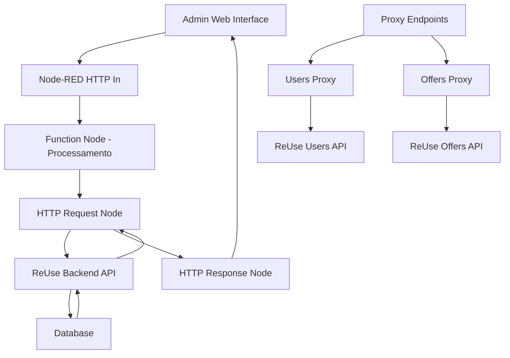

# 🏗️ Arquitetura e Integração Node-RED + ReUse API

## 📋 Visão Geral do Sistema

O painel administrativo ReUse utiliza **Node-RED** como middleware para integrar uma interface web moderna com as APIs do backend ReUse. Esta arquitetura permite criar um painel administrativo completo sem modificar o código do backend principal.

---

## 🔄 Fluxo de Dados Completo



---

## 🧩 Componentes Principais

### 1. **HTTP In Nodes** (Entrada)
- **Função**: Receber requisições HTTP do navegador
- **Rotas Configuradas**:
  - `/admin` → Página de login
  - `/admin/dashboard` → Dashboard principal
  - `/admin/users` → Gerenciamento de usuários
  - `/admin/offers` → Gerenciamento de ofertas
  - `/api/users-proxy` → Proxy para API de usuários
  - `/api/offers-proxy` → Proxy para API de ofertas

### 2. **Function Nodes** (Processamento)
- **Função**: Gerar HTML dinâmico e processar lógica
- **Características**:
  - Executam JavaScript server-side
  - Geram páginas HTML completas
  - Incluem CSS e JavaScript inline
  - Processam dados antes de enviar para o frontend

### 3. **HTTP Request Nodes** (Integração API)
- **Função**: Fazer requisições para o backend ReUse
- **Configurações**:
  - **URL**: `http://localhost:3000/api/users` e `http://localhost:3000/api/offers`
  - **Método**: GET
  - **Headers**: `Content-Type: application/json`
  - **CORS**: Resolvido via proxy server-side

### 4. **HTTP Response Nodes** (Saída)
- **Função**: Enviar resposta HTTP para o navegador
- **Headers**: `Content-Type: text/html; charset=utf-8`
- **Status**: 200 (sucesso)

---

## 🔗 Integração com APIs ReUse

### **Proxy Pattern Implementation**

O sistema utiliza o padrão **Proxy** para resolver problemas de CORS e facilitar a integração:

```javascript
// Fluxo: Frontend → Node-RED Proxy → ReUse API
Frontend (localhost:1880) 
    ↓ fetch('/api/users-proxy')
Node-RED Proxy (localhost:1880/api/users-proxy)
    ↓ HTTP Request para localhost:3000/api/users
ReUse API (localhost:3000)
    ↓ Resposta JSON
Node-RED Proxy
    ↓ Retorna dados para frontend
Frontend
```

### **Endpoints de Proxy**

#### 1. **Users Proxy** (`/api/users-proxy`)
```json
{
  "id": "users-api-proxy-in",
  "type": "http in",
  "url": "/api/users-proxy",
  "method": "get"
}
```
- **Conecta com**: `http://localhost:3000/api/users`
- **Retorna**: Lista completa de usuários
- **Headers CORS**: `Access-Control-Allow-Origin: *`

#### 2. **Offers Proxy** (`/api/offers-proxy`)
```json
{
  "id": "offers-api-proxy-in", 
  "type": "http in",
  "url": "/api/offers-proxy",
  "method": "get"
}
```
- **Conecta com**: `http://localhost:3000/api/offers`
- **Retorna**: Lista completa de ofertas
- **Headers CORS**: `Access-Control-Allow-Origin: *`

---

## 📊 Processamento de Dados

### **Transformação de Dados**

Os Function Nodes processam os dados da API ReUse para o formato esperado pelo frontend:

#### **Usuários**:
```javascript
// Dados da API ReUse
{
  "id": "cmg5z8x7x0000kc70tuq2bsub",
  "name": "João Silva",
  "email": "joao@email.com",
  "createdAt": "2025-09-30T00:07:41.000Z",
  "isBlocked": false
}

// Transformação para Frontend
{
  "id": "cmg5z8x7x0000kc70tuq2bsub",
  "safeId": "user_0",  // ID seguro para JavaScript
  "name": "João Silva",
  "email": "joao@email.com",
  "avatar": "https://ui-avatars.com/api/?name=João&background=27ae60&color=fff",
  "status": "active",
  "statusText": "Ativo desde 30/09/2025",
  "isBlocked": false
}
```

#### **Ofertas**:
```javascript
// Dados da API ReUse
{
  "id": "offer_123",
  "title": "",
  "description": "Capivara de chapeu",
  "category": "Brinquedos",
  "createdAt": "2025-09-30T00:07:41.000Z",
  "status": "pending"
}

// Transformação para Frontend
{
  "id": "offer_123",
  "safeId": "offer_0",
  "title": "Capivara de chapeu",  // Gerado dinamicamente
  "description": "Capivara de chapeu",
  "category": "Brinquedos",
  "status": "pending",
  "isActive": true
}
```

---

## 🎨 Geração de Interface

### **HTML Dinâmico**

Cada Function Node gera uma página HTML completa:

```javascript
msg.payload = `<!DOCTYPE html>
<html>
<head>
    <title>ReUse Admin - Dashboard</title>
    <meta charset="UTF-8">
    <script src="https://cdn.jsdelivr.net/npm/chart.js"></script>
    <style>
        /* CSS inline completo */
    </style>
</head>
<body>
    <!-- Interface HTML -->
    <script>
        // JavaScript inline para interatividade
        async function loadData() {
            const response = await fetch('/api/users-proxy');
            // Processar dados...
        }
    </script>
</body>
</html>`;
```

### **Características da Interface**:

1. **Responsiva**: CSS Grid e Flexbox
2. **Interativa**: JavaScript vanilla
3. **Moderna**: Design system consistente
4. **Funcional**: Modais, toasts, gráficos
5. **Integrada**: Dados reais da API

---

## 🔄 Fluxos de Trabalho

### **1. Carregamento de Página**
```
1. Usuário acessa /admin/users
2. HTTP In Node recebe requisição
3. Function Node gera HTML
4. HTTP Response Node envia página
5. Frontend executa JavaScript
6. JavaScript faz fetch para /api/users-proxy
7. Proxy Node busca dados na API ReUse
8. Dados são retornados e exibidos
```

### **2. Ações de Usuário**
```
1. Usuário clica em "Bloquear usuário"
2. JavaScript abre modal de confirmação
3. Usuário confirma ação
4. JavaScript simula requisição (implementar API calls)
5. Interface atualiza localmente
6. Toast de sucesso é exibido
```

---

## 🛠️ Configuração Técnica

### **Node-RED Settings**
```javascript
// settings.js
module.exports = {
    httpAdminRoot: '/admin',
    httpNodeRoot: '/api',
    userDir: './data',
    flowFile: 'flows.json',
    credentialSecret: 'reuse-admin-secret'
};
```

### **Dependências**
```json
{
  "node-red": "^3.0.0",
  "node-red-contrib-http-request": "^1.0.0"
}
```

### **Portas Utilizadas**
- **Node-RED**: `localhost:1880`
- **ReUse API**: `localhost:3000`
- **Admin Panel**: `localhost:1880/admin`

---

## 🔒 Segurança e Autenticação

### **Sistema de Login**
- **Token**: Armazenado em `localStorage`
- **Validação**: JavaScript client-side
- **Redirecionamento**: Automático para `/admin` se não autenticado

### **CORS Resolution**
- **Problema**: Frontend não pode acessar API diretamente
- **Solução**: Proxy server-side no Node-RED
- **Benefício**: Mesmo domínio, sem problemas de CORS

---

## 📈 Monitoramento e Logs

### **Logs do Node-RED**
```bash
# Console do Node-RED mostra:
[INFO] Carregando usuários via proxy Node-RED...
[INFO] Dados recebidos via proxy: (8) [{…}, {…}, ...]
[INFO] Usuários processados: (8) [{…}, {…}, ...]
```

### **Debug de Requisições**
- **Network Tab**: Mostra chamadas para `/api/users-proxy`
- **Console**: Logs de processamento de dados
- **Node-RED Editor**: Visualização de fluxos em tempo real

---

## 🚀 Vantagens da Arquitetura

### **1. Separação de Responsabilidades**
- **Backend ReUse**: Lógica de negócio e dados
- **Node-RED**: Interface administrativa
- **Frontend**: Interação do usuário

### **2. Flexibilidade**
- **Modificações**: Sem tocar no backend principal
- **Deploy**: Independente do sistema principal
- **Escalabilidade**: Fácil adicionar novas funcionalidades

### **3. Manutenibilidade**
- **Código**: Organizado em flows visuais
- **Debug**: Interface gráfica do Node-RED
- **Atualizações**: Deploy via interface web

### **4. Performance**
- **Proxy**: Reduz latência de requisições
- **Cache**: Possível implementar cache no Node-RED
- **Otimização**: Processamento server-side

---

## 🔧 Troubleshooting

### **Problemas Comuns**

1. **API não responde**:
   - Verificar se ReUse API está rodando em `localhost:3000`
   - Testar: `curl http://localhost:3000/api/users`

2. **CORS Errors**:
   - Usar sempre os endpoints proxy (`/api/users-proxy`)
   - Não acessar API diretamente do frontend

3. **Dados não carregam**:
   - Verificar logs do Node-RED
   - Testar endpoints proxy individualmente

4. **Interface não atualiza**:
   - Fazer Deploy no Node-RED após mudanças
   - Limpar cache do navegador

---

## 📚 Próximos Passos

### **Melhorias Futuras**
1. **Autenticação Real**: Integrar com JWT do backend
2. **Ações CRUD**: Implementar POST/PUT/DELETE
3. **Cache**: Adicionar cache para melhor performance
4. **Websockets**: Atualizações em tempo real
5. **Logs**: Sistema de auditoria completo

### **Extensões Possíveis**
1. **Relatórios**: Gráficos mais avançados
2. **Notificações**: Sistema de alertas
3. **Backup**: Exportação de dados
4. **Multi-tenant**: Suporte a múltiplas organizações

---

## 🎯 Conclusão

A integração Node-RED + ReUse API cria um **painel administrativo robusto e flexível** que:

- ✅ **Mantém o backend original intacto**
- ✅ **Fornece interface moderna e responsiva**
- ✅ **Resolve problemas de CORS automaticamente**
- ✅ **Permite fácil manutenção e extensão**
- ✅ **Oferece visualização de dados em tempo real**

Esta arquitetura é **ideal para sistemas que precisam de interfaces administrativas** sem modificar o código principal, mantendo a **separação de responsabilidades** e **facilitando a manutenção**.

